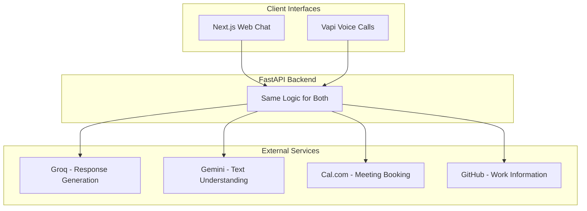
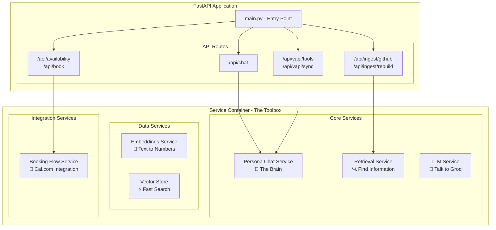
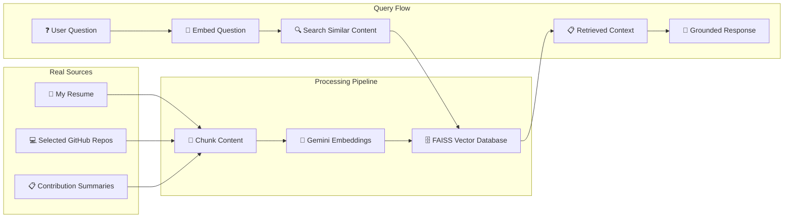
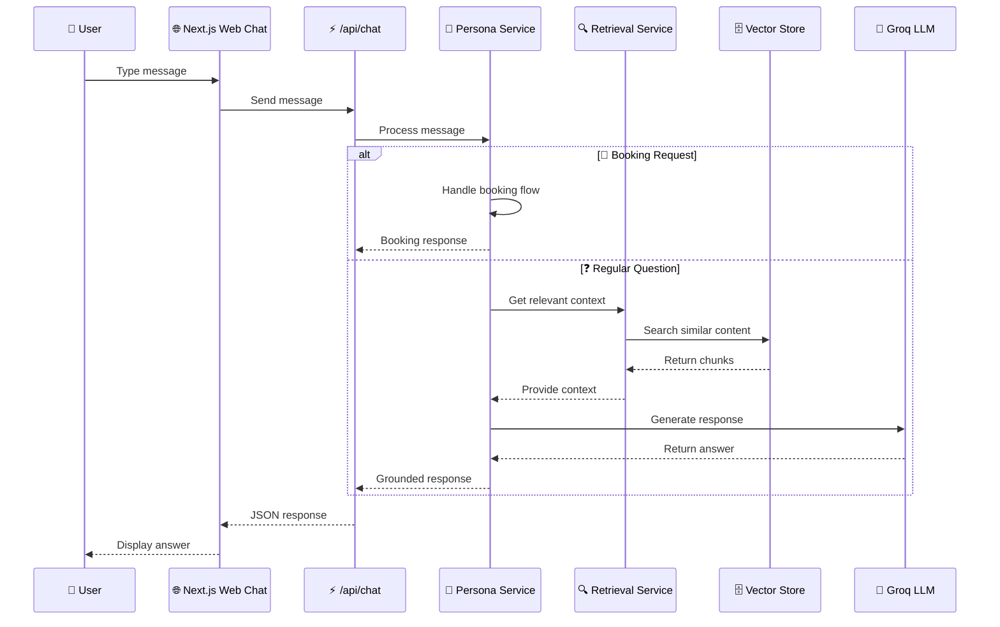
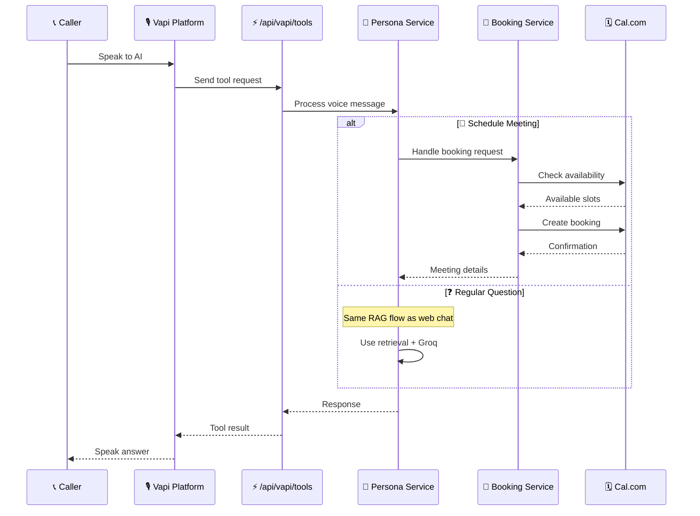

# AI Persona Architecture Walkthrough

## Introduction

This is a conversational AI that people can chat with on the web or call on the phone, and it can also book meetings for me. Let me show you how it all works under the hood.

## System Overview - The Big Picture

We have two ways people interact with the system:
- Web chat interface built with Next.js
- Call me directly through Vapi, which handles the voice calls

Both of these go into the same FastAPI backend - that's the key here. Whether someone types a message or speaks to me on the phone, it all flows through the same logic, so the responses are consistent.

The backend talks to a few external services:
- **Groq** for generating responses
- **Gemini** for understanding the meaning of text  
- **Cal.com** for booking meetings
- **GitHub** to pull in information about my work

## Backend Architecture - Under the Hood

Everything starts with **main.py**, which sets up all these API routes you see here:
- `/api/chat`
- `/api/availability` & `/api/book` (booking)
- `/api/ingest/github` & `/api/ingest/rebuild` (ingesting data)
- `/api/vapi/tools` & `/api/vapi/sync` (Vapi integration)

The real magic happens in this **service container**. Think of it like a toolbox where each tool has a specific job:

- **Persona chat service** - the brain that decides how to respond
- **Retrieval service** - finds relevant information
- **LLM service** - talks to Groq to generate natural responses

Then we have **data services** that handle embeddings and the vector store - basically turning text into numbers so we can search through it quickly.

And **integration services** that handle booking meetings through Cal.com.

## RAG Pipeline - Keeping it Grounded

This diagram shows how I keep the AI grounded in real information. Instead of just making stuff up, it pulls from three sources:
- My resume
- Selected GitHub repositories  
- Summaries of my contributions

All this content gets chunked up, turned into embeddings through Gemini, and stored in a FAISS vector database. 

When someone asks a question, we embed their question the same way, search for similar content, and use that as context for generating the response.

## Request Flow - Web Chat

Let me show you what happens when someone actually uses the system. For web chat:

1. They send a message
2. It goes to the persona service
3. Which decides if they're trying to book a meeting or just asking a question

If it's a regular question:
- We retrieve relevant context from the vector store
- Build a prompt with that context
- Send it to Groq
- Return a grounded response

## Request Flow - Voice & Booking

For voice calls, it's similar but goes through Vapi first. 

The cool thing is that booking works the same way whether you're typing or talking - it all uses the same booking flow service that connects to Cal.com.

## Architecture Strengths - Why This Works

What I really like about this architecture:

**Unified** - Web and voice use the same backend logic

**Grounded** - Answers come from real sources, not hallucinations  

**Clean** - Each service has one job, so I can update parts without breaking everything else

---

That's the architecture! It might look complex, but it's actually pretty straightforward:
- Take input from multiple channels
- Find relevant information  
- Generate a response
- Handle booking if needed

The key is keeping everything flowing through the same backend so the experience is consistent no matter how people interact with it.