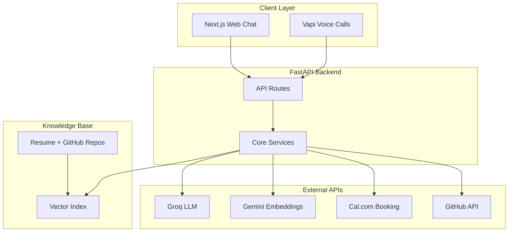
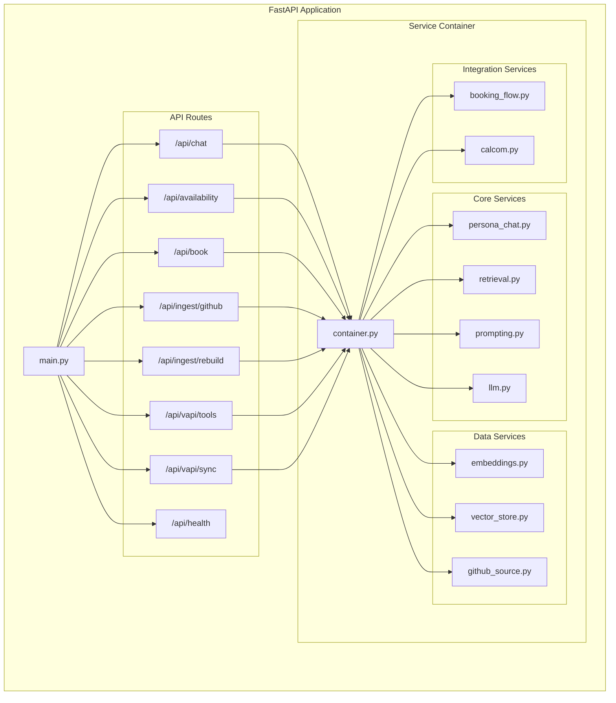
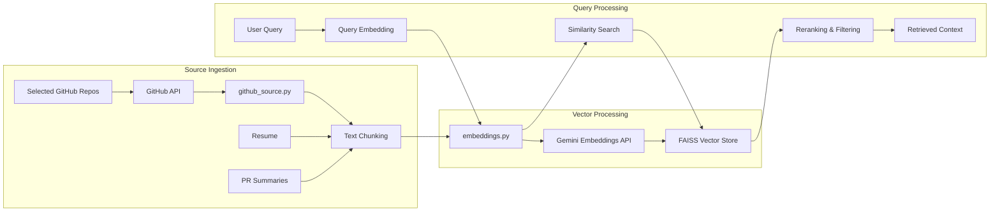
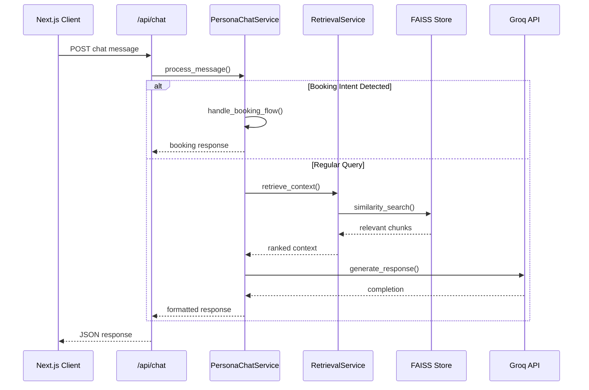
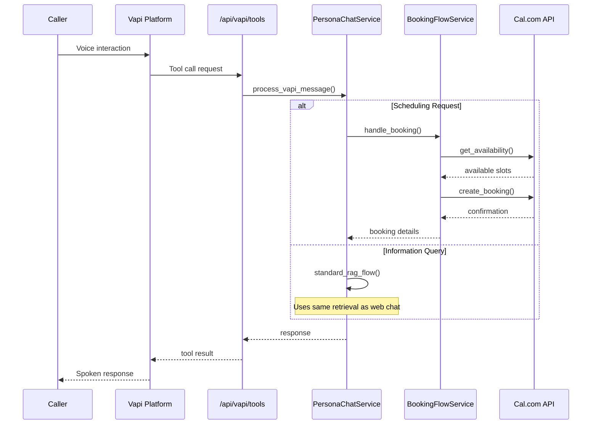

# AI Persona Architecture

A FastAPI-powered conversational AI system with RAG-based knowledge retrieval, multi-surface interaction (web chat and voice calls), and integrated scheduling. The backend serves as the unified control plane for consistent behavior across all client interfaces.

## System Overview

## Backend Architecture

## RAG Pipeline

## Web Chat Request Flow

## Voice & Booking Flow

## Architecture Strengths

**Unified Backend Logic**: Both web chat and voice calls flow through the same PersonaChatService, ensuring consistent behavior and responses across all interaction surfaces.

**Grounded Knowledge**: RAG pipeline uses only curated sources (resume, selected repos, PR summaries) stored locally, eliminating hallucination and maintaining answer quality through controlled indexing.

**Clean Separation**: Ingestion, retrieval, generation, and external integrations are isolated into dedicated services, allowing independent evolution and easier testing of each component.

**Stateless Design**: Request-response model with conversation context managed at the application layer enables horizontal scaling and simplified deployment.