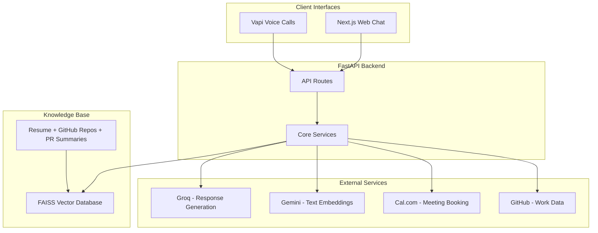
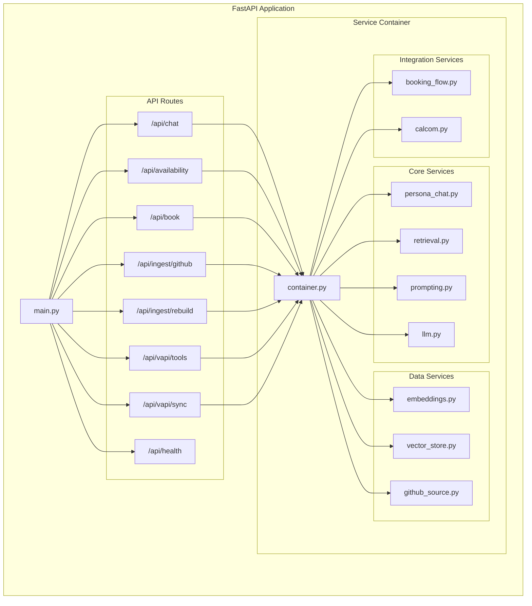
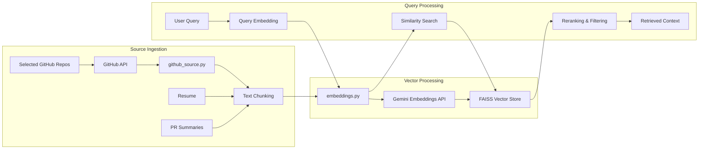
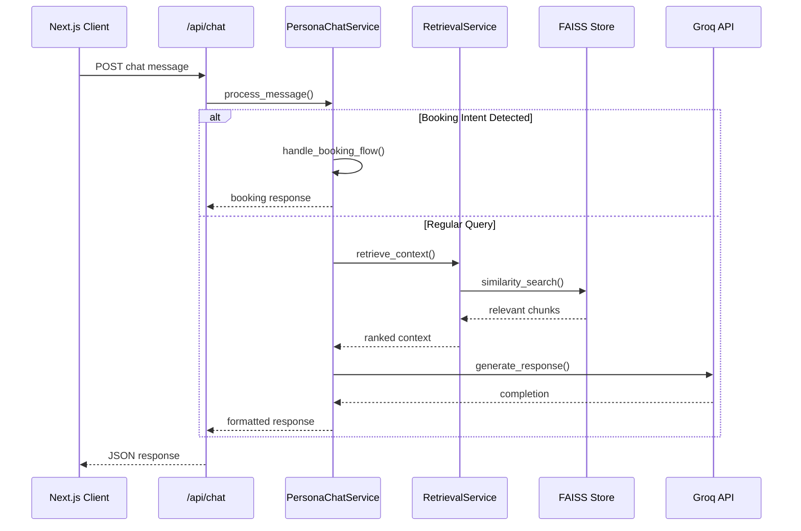
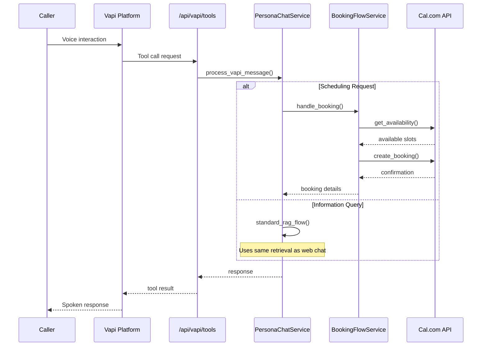

# AI Persona Architecture

A conversational AI that people can chat with on the web or call on the phone, and can also book meetings. Built with FastAPI backend, Next.js frontend, Vapi voice integration, and RAG-based knowledge retrieval.

## System Overview

Two ways to interact: web chat interface built with Next.js, or voice calls through Vapi. Both go into the same FastAPI backend - that's the key. Whether someone types a message or speaks on the phone, it all flows through the same logic for consistent responses.

The backend talks to external services: Groq for generating responses, Gemini for understanding text meaning, Cal.com for booking meetings, and GitHub to pull in work information.

## Backend Architecture

Everything starts with main.py, which sets up API routes for chat, booking, data ingestion, and Vapi integration. The real magic happens in the service container - like a toolbox where each tool has a specific job. 

The persona chat service is the brain that decides how to respond. The retrieval service finds relevant information. The LLM service talks to Groq to generate natural responses. Data services handle embeddings and the vector store (turning text into numbers for fast search). Integration services handle booking meetings through Cal.com.

## RAG Pipeline

This keeps the AI grounded in real information instead of making things up. It pulls from three sources: resume, selected GitHub repositories, and contribution summaries.

All content gets chunked up, turned into embeddings through Gemini, and stored in a FAISS vector database. When someone asks a question, we embed their question the same way, search for similar content, and use that as context for generating the response.

## Request Flow - Web Chat

When someone uses the web chat, they send a message that goes to the persona service, which decides if they're trying to book a meeting or asking a question.

For regular questions: retrieve relevant context from the vector store, build a prompt with that context, send it to Groq, and return a grounded response.

## Request Flow - Voice & Booking

For voice calls, it's similar but goes through Vapi first. The cool thing is that booking works the same way whether you're typing or talking - it all uses the same booking flow service that connects to Cal.com.

## Why This Architecture Works

**Unified**: Web and voice use the same backend logic, so responses stay consistent no matter how people interact with it.

**Grounded**: Answers come from real sources (resume, GitHub repos, PR summaries), not hallucinations.

**Clean**: Each service has one job, so you can update parts without breaking everything else.

The system is straightforward: take input from multiple channels, find relevant information, generate a response, and handle booking if needed. The key is keeping everything flowing through the same backend for consistent experience.